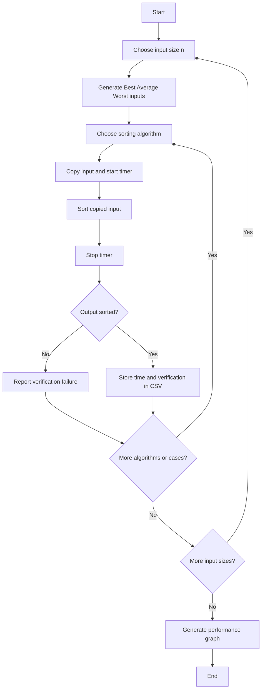

# Sorting Analyzer Flowchart

```mermaid
flowchart TD
    A[Start] --> B[Choose input size n]
    B --> C[Generate Best Average Worst inputs]
    C --> D[Choose sorting algorithm]
    D --> E[Copy input and start timer]
    E --> F[Sort copied input]
    F --> G[Stop timer]
    G --> H{Output sorted?}
    H -- No --> I[Report verification failure]
    H -- Yes --> J[Store time and verification in CSV]
    I --> K{More algorithms or cases?}
    J --> K
    K -- Yes --> D
    K -- No --> L{More input sizes?}
    L -- Yes --> B
    L -- No --> M[Generate performance graph]
    M --> N[End]
```